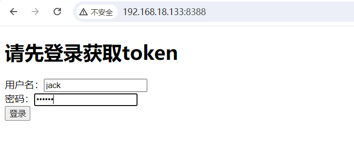
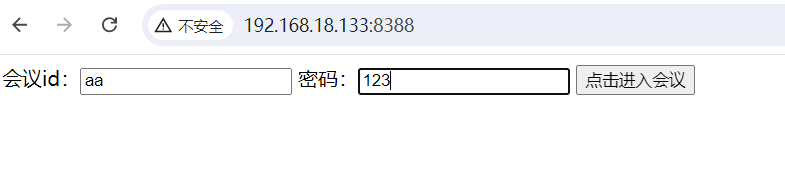
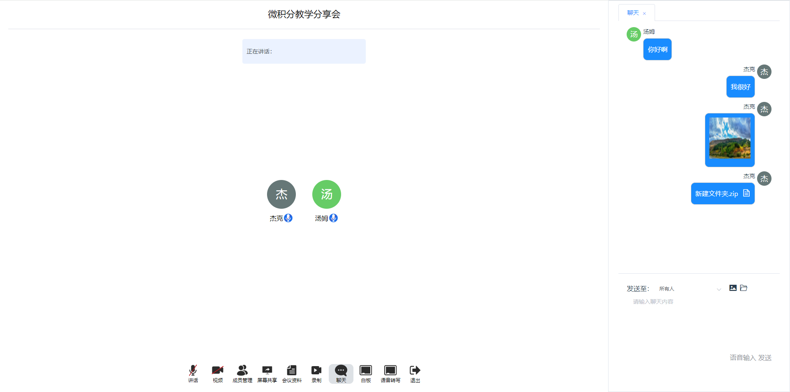
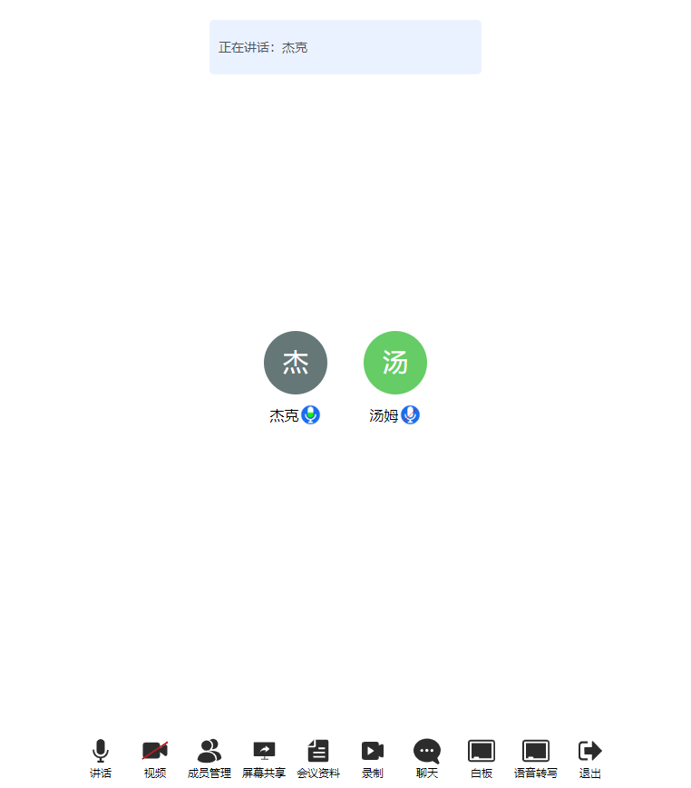
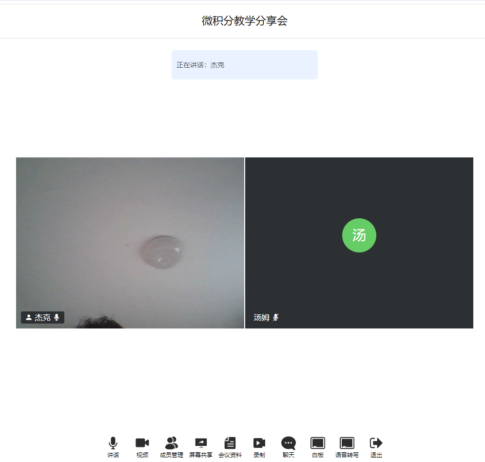
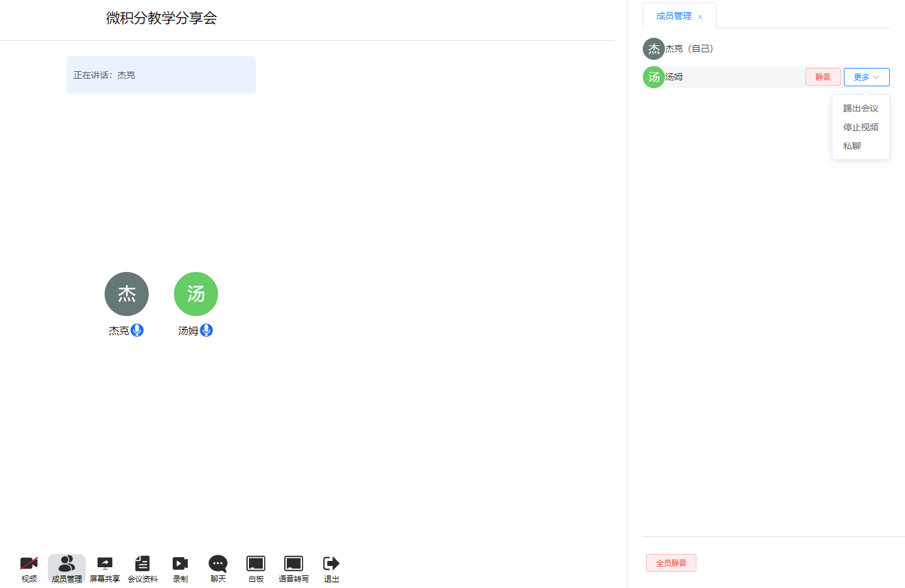
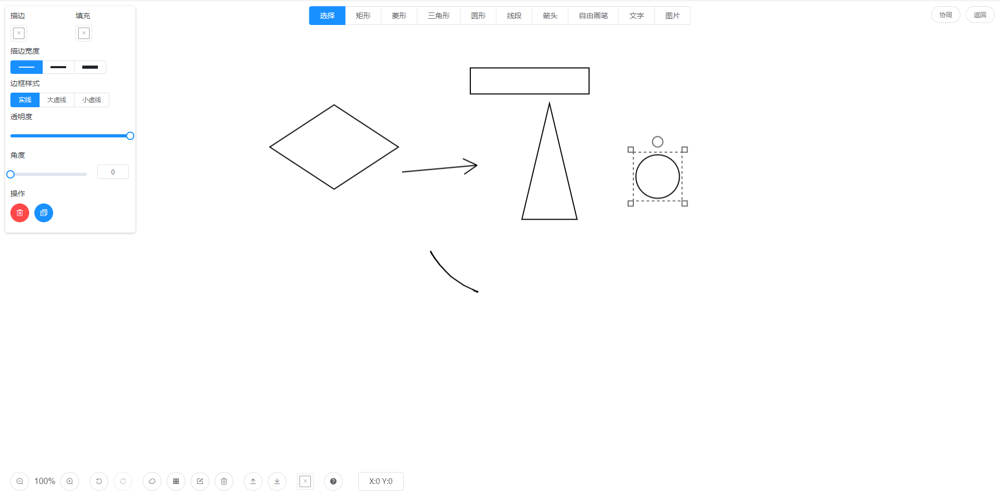
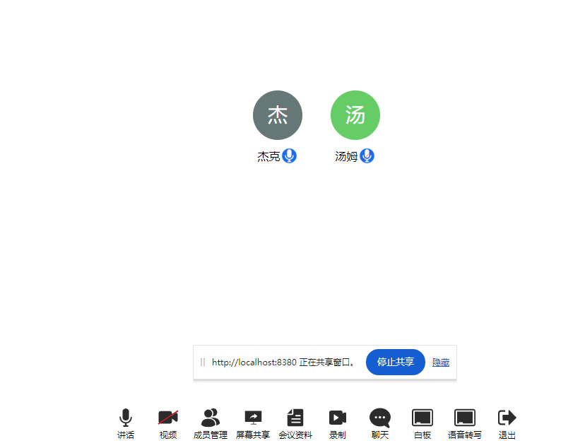

# 即迅在线会议系统

即迅在线会议系统是一套稳定的、适配全平台、基于浏览器的在线会议解决方案。如果您觉得我们的开源软件对你有所帮助，请start。

- Github地址：https://github.com/insmess/insmess-meeting
- Gitee地址：https://gitee.com/insmess_enterprise/insmess-meeting.git

商务合作请加微信：insmess01

商务合作可开具13%的增值税发票。

## 一、主要特点

- 适配国产化环境，可在国产化服务器、国产化客户端浏览器流畅运行；
- 高性能，支持百人以上用户同时开展会议，支持集群部署；
- 支持私有化内网环境部署，不依靠外网环境；
- 提供二次开发SDK，可快速进行二次开发，并支持与第三方系统用户集成；

## 二、具备功能

- 及时消息服务，用户在会议中可发送文字、图片、文件等内容。
- 语音输入，通过语音发言，并将语音信息转写成文字。
- 音频交互，用户可通过麦克风进行音频交互。
- 视频交互，用户可通过摄像头进行视频交互。
- 会议成员管理，区分主持人与普通参会成员，主持人可对参会成员进行禁言，禁用摄像头等操作。
- 协同白板，多个用户可进行协同式白板操作。
- 思维导图，支持会议思维导图绘制。
- 屏幕共享，允许用户将屏幕内容实时分享给他人。
- 会议录制，可将会议过程中的用户音视频信息进行录制。
- 实时转写，将发言用户的语音信息实时转写成文字。
- 会议资料管理，对会议室资料进行上传、下载、删除等操作。并支持word、Excel、图片、视频、音频、文本文件的在线预览。
- 会议加密，对会议设置密码，保证会议的安全性。

## 三、快速开始

### 3.1 离线自动安装（推荐）

**1、部署包下载**

本产品主要特点试用离线环境，部署包一次下载，即可在无网络状态内网部署。

**百度网盘：**`链接: https://pan.baidu.com/s/1LyrHQz1-qnC_6jqKKYjjrw?pwd=ce99`

**2、上传服务包**

将安装包`insmess-meeting_x86_docker.tar.gz`上传至服务器任意位置。

**3、解压**

```shell
tar -zxvf insmess-meeting_x86_docker.tar.gz
```

**4、执行**

```shell
# 进入安装包目录
cd insmess-meeting_x86_docker
# 执行
sh install.sh
```

> 执行过程中输入服务器的IP地址

**5、访问**

`http://ip:8388/`



几个测试的用户名密码：

```
jack 123456
lucy 123456
tony 123456
```

登录成功之后，输入以下会议号和密码登录会议

```
会议id：aa
会议密码：123
```



## 四、功能介绍

### 4.1 及时消息

支持在线聊天功能，可在会议聊天室内发送文字、图片、文件等消息，并支持向所有人发送消息以及向单独某个会议成员发送消息。



### 4.2 语音输入

支持语音输入功能，可利用麦克风将发言信息实时转换成文字，并支持转换结果的编辑。


### 4.3 音频交互

会议成员可通过麦克风与其他人进行交互，并支持麦克风开启状态、用户发言状态检测功能，可将发言用户在界面中进行展示。



### 4.4 视频交互

会议成员可通过摄像头与其他会议成员进行交互



### 4.5 会议成员管理

区分主持人与普通参会成员，主持人支持对参会成员的麦克风、摄像头的权限与状态进行管理，支持对会议成员踢出、静音、关闭摄像头等操作。



### 4.6 协同白板

提供会议白板功能，会议成员之间可协同操作会议白板



### 4.7 屏幕共享

支持会议成员的屏幕共享功能，可将屏幕内容共享给其他会议成员观看。



### 4.8 实时转写

可将会议中会议成员的发言内容实时转写成文字，便于查看预览。


### 4.9 会议录制

支持会议录制功能，可将会议中的音视频内容进行录制，会后可查看。