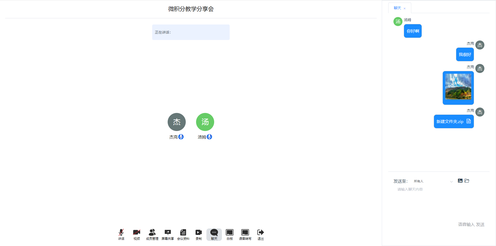
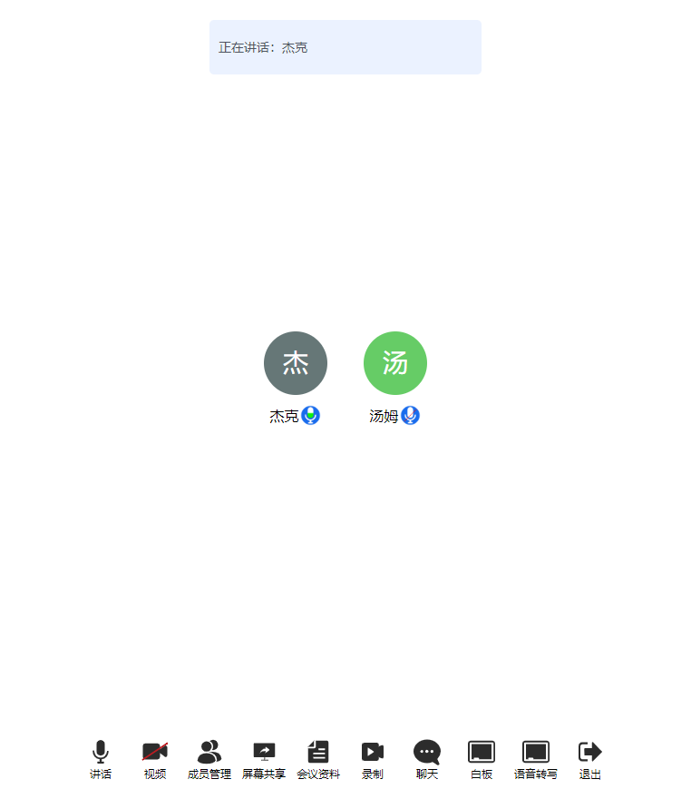
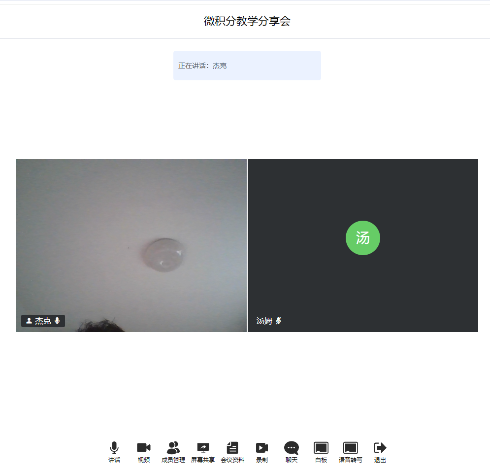
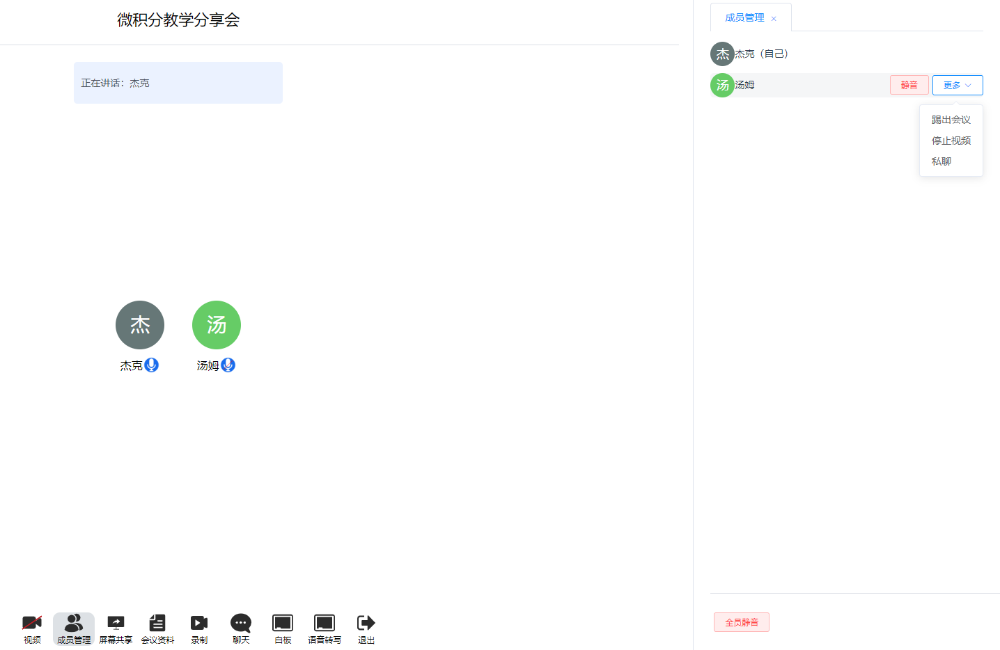
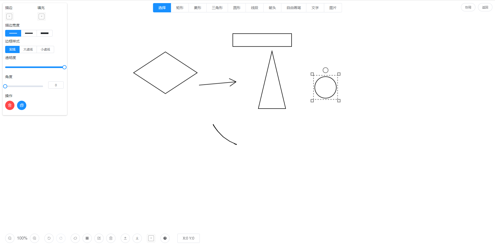
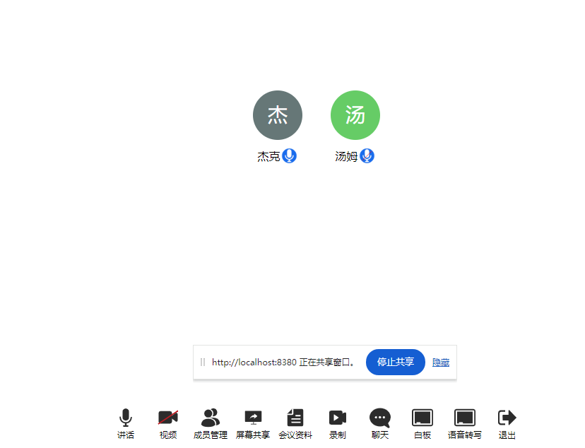

# 即迅在线会议系统

即迅在线会议系统是一套稳定的、适配全平台、基于浏览器的在线会议解决方案。

## 主要特点

- 适配国产化环境，可在国产化服务器、国产化客户端浏览器流畅运行；
- 高性能，支持百人以上用户同时开展会议，支持集群部署；
- 支持私有化内网环境部署，不依靠外网环境；
- 提供二次开发SDK，可快速进行二次开发，并支持与第三方系统用户集成；

## 具备功能

- 及时消息服务，用户在会议中可发送文字、图片、文件等内容。
- 语音输入，通过语音发言，并将语音信息转写成文字。
- 音频交互，用户可通过麦克风进行音频交互。
- 视频交互，用户可通过摄像头进行视频交互。
- 会议成员管理，区分主持人与普通参会成员，主持人可对参会成员进行禁言，禁用摄像头等操作。
- 协同白板，多个用户可进行协同式白板操作。
- 屏幕共享，允许用户将屏幕内容实时分享给他人。
- 会议录制，可将会议过程中的用户音视频信息进行录制。
- 实时转写，将发言用户的语音信息实时转写成文字。
- 会议资料管理，对会议室资料进行上传、下载、删除等操作。并支持word、Excel、图片、视频、音频、文本文件的在线预览。
- 会议加密，对会议设置密码，保证会议的安全性。

## 版本对比

|     功能     | 免费版 | 企业版 | 专业版 |
| :----------: | :----: | :----: | :----: |
|   及时消息   |   √    |   √    |   √    |
|   音频交互   |   √    |   √    |   √    |
|   视频交互   |   √    |   √    |   √    |
|   权限管理   |   ×    |   √    |   √    |
|   屏幕共享   |   ×    |   √    |   √    |
|   协同白板   |   ×    |   √    |   √    |
|   会议录制   |   ×    |   √    |   √    |
| 会议资料管理 |   ×    |   √    |   √    |
| 语音识别服务 |   ×    |   ×    |   √    |
| 语音文字转写 |   ×    |   ×    |   √    |
| 实时会议转写 |   ×    |   ×    |   √    |

## 产品价格

| 版本             | 价格 | 备注                                           |
| ---------------- | ---- | ---------------------------------------------- |
| 免费版           | 0    | 不提供技术服务                                 |
| 企业版（无源码） | 8W   | 提供为期一年的技术服务保障，以及产品更新服务。 |
| 企业版（带源码） | 18W  | 提供为期一年的技术服务保障，以及产品更新服务。 |
| 专业版（无源码） | 28W  | 提供为期一年的技术服务保障，以及产品更新服务。 |
| 专业版（带源码） | 48W  | 提供为期一年的技术服务保障，以及产品更新服务。 |
| 定制版           | 面议 | 提供定制版的会议系统，价格面议                 |
| 语音识别系统     | 20W  | 具备语音识别，声纹识别，语音合成等功能。       |

## 功能介绍

### 及时消息

支持在线聊天功能，可在会议聊天室内发送文字、图片、文件等消息，并支持向所有人发送消息以及向单独某个会议成员发送消息。

### 语音输入

支持语音输入功能，可利用麦克风将发言信息实时转换成文字，并支持转换结果的编辑。

### 音频交互

会议成员可通过麦克风与其他人进行交互，并支持麦克风开启状态、用户发言状态检测功能，可将发言用户在界面中进行展示。

### 视频交互

会议成员可通过摄像头与其他会议成员进行交互

### 会议成员管理

区分主持人与普通参会成员，主持人支持对参会成员的麦克风、摄像头的权限与状态进行管理，支持对会议成员踢出、静音、关闭摄像头等操作。

### 协同白板

提供会议白板功能，会议成员之间可协同操作会议白板

### 屏幕共享

支持会议成员的屏幕共享功能，可将屏幕内容共享给其他会议成员观看。

### 实时转写

可将会议中会议成员的发言内容实时转写成文字，便于查看预览。

### 会议录制

支持会议录制功能，可将会议中的音视频内容进行录制，会后可查看。

### 会议资料管理

对会议室资料进行上传、下载、删除等操作。并支持word、Excel、图片、视频、音频、文本文件的在线预览

